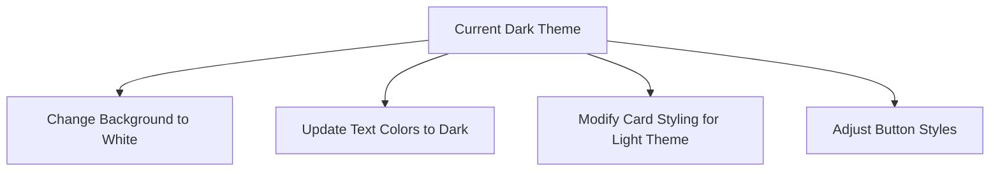
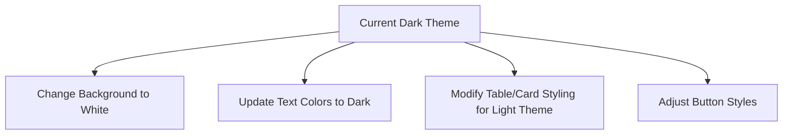
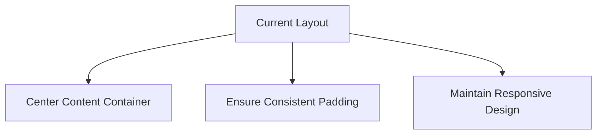
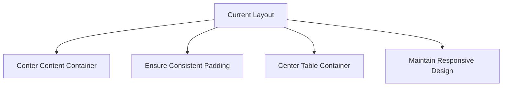

# Theme Adjustment and Content Centering Implementation for Admin Pages

## Overview

This document outlines the design for adjusting the theme from dark to light (white) for all admin pages and ensuring proper content centering in the product upload and product management pages. The changes will create a consistent user experience across all admin interfaces while maintaining the existing functionality.

## Current State Analysis

### Theme Implementation
- The main dashboard page (`/admin/src/app/page.tsx`) currently uses a dark gradient theme with:
  - Background: `linear-gradient(0deg, black, #3c2a98)`
  - Text colors: White and light gray (`#e6e0f0`)
  - Card components with dark-themed styling

- The product upload page (`/admin/src/app/product_upload/page.tsx`) and products management page (`/admin/src/app/products/page.tsx`) use a light gradient theme:
  - Background: `bg-gradient-to-br from-[#f9f3fa] to-[#e6e0f0]`
  - Content: Light-themed with white cards

- The super admin page (`/admin/src/app/super_admin/page.tsx`) uses a dark gradient theme similar to the main dashboard

### Content Centering Issues
- The product upload page content is not properly centered
- The products management page container is not centered
- Both pages use `max-w-7xl mx-auto` but have inconsistent padding/margin implementation

## Design Changes

### 1. Theme Adjustment

#### Main Dashboard Page (`/admin/src/app/page.tsx`)
- Change background from dark gradient to light theme:
  - Replace `background: linear-gradient(0deg, ${TERTIARY_COLOR_BLUE}, ${SECONDARY_COLOR_PURPLE})` with white background
  - Update text colors from white to dark gray (`text-gray-900`)
  - Modify card backgrounds to use light theme styling
  - Update button styles to match light theme

#### Super Admin Page (`/admin/src/app/super_admin/page.tsx`)
- Change background from dark gradient to light theme:
  - Replace `bg-gradient-to-br from-[#3c2a98] via-[#2a1e6b] to-black` with white background
  - Update text colors from white to dark gray
  - Modify card/table backgrounds to use light theme styling
  - Update button styles to match light theme

#### Product Upload Page (`/admin/src/app/product_upload/page.tsx`)
- Already uses light theme but needs minor adjustments:
  - Ensure consistent padding/margin
  - Center content properly within the container

#### Products Management Page (`/admin/src/app/products/page.tsx`)
- Already uses light theme but needs minor adjustments:
  - Ensure consistent padding/margin
  - Center content properly within the container

### 2. Content Centering

#### Product Upload Page
- Ensure the main container uses proper centering classes:
  - `flex flex-col items-center justify-center` for vertical centering
  - `mx-auto` for horizontal centering
  - Consistent padding on all sides

#### Products Management Page
- Apply similar centering techniques as product upload page
- Ensure the table container is properly centered
- Maintain responsive design for different screen sizes

## Implementation Plan

### File Modifications

#### 1. Main Dashboard Page (`/admin/src/app/page.tsx`)

#### 2. Super Admin Page (`/admin/src/app/super_admin/page.tsx`)

#### 3. Product Upload Page (`/admin/src/app/product_upload/page.tsx`)

#### 4. Products Management Page (`/admin/src/app/products/page.tsx`)

### CSS/Component Changes

#### Color Palette Updates
| Element | Current (Dark Theme) | New (Light Theme) |
|---------|----------------------|-------------------|
| Background | `linear-gradient(0deg, black, #3c2a98)` | `white` or `bg-gray-50` |
| Text Primary | `text-white` | `text-gray-900` |
| Text Secondary | `text-[#e6e0f0]` | `text-gray-600` |
| Card Background | `bg-white/10 backdrop-blur-lg` | `bg-white` |
| Button Primary | `bg-[#e00885]` | `bg-[#e00885]` (unchanged) |
| Button Secondary | `bg-white/10 backdrop-blur-lg` | `bg-gray-100` |

#### Layout Adjustments
1. Update container classes to ensure proper centering:
   - Use `flex flex-col items-center justify-center min-h-screen` for full-page centering
   - Apply `mx-auto` to container elements
   - Ensure consistent padding with `px-4 sm:px-6 lg:px-8`

2. Maintain responsive design:
   - Keep existing responsive breakpoints
   - Ensure content doesn't overflow on smaller screens
   - Test on mobile, tablet, and desktop views

## Component Architecture

### Shared Components
- Navbar and Sidebar components will remain unchanged as they already use a light theme
- Color constants in `constant.ts` will remain unchanged to maintain brand consistency

### Page Components
- Main dashboard page will be updated to use light theme
- Super admin page will be updated to use light theme
- Product upload and products management pages will receive layout adjustments

## Styling Strategy

### Tailwind CSS Classes
- Primary background: `bg-white` or `bg-gray-50`
- Text colors: `text-gray-900` (primary), `text-gray-600` (secondary)
- Card styling: `bg-white shadow rounded-lg`
- Container centering: `max-w-7xl mx-auto px-4 sm:px-6 lg:px-8`

### Responsive Design
- Mobile-first approach with responsive breakpoints
- Consistent padding and margin across all screen sizes
- Properly sized elements for touch interfaces

## Testing Strategy

### Visual Testing
- Verify theme consistency across all admin pages
- Check content centering on different screen sizes
- Ensure proper spacing and alignment of elements

### Functional Testing
- Confirm all interactive elements work as expected
- Verify navigation between pages functions correctly
- Test form submissions and data display

## Dependencies

### Internal Dependencies
- Navbar component (no changes required)
- Sidebar component (no changes required)
- Color constants (no changes required)

### External Dependencies
- Tailwind CSS (existing configuration)
- Next.js (existing setup)
- React (existing version)

## Security Considerations

No security implications from theme and layout changes. All modifications are purely presentational and do not affect authentication, authorization, or data handling.

## Performance Considerations

- Minimal impact on performance as changes are purely CSS-based
- No additional assets or dependencies required
- Maintaining existing optimization techniques